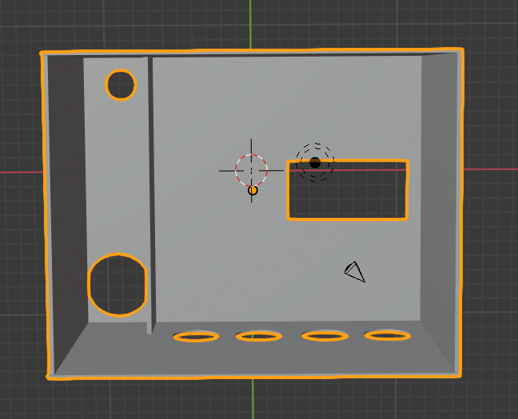
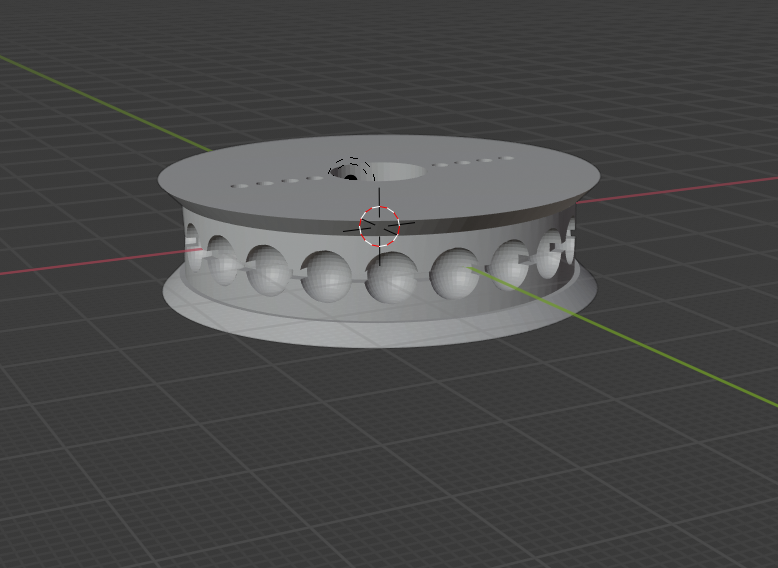
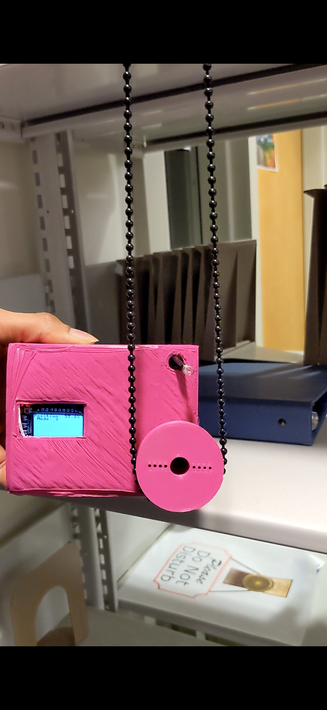

# motorized-shade-puller
Motorized Shade Puller 
by Jeff Rodriguez and Roodharvens Joseph
Final Report and Repository for CS435 Project

 
Table of Contents:
### [Introduction](#introduction-to-the-motorized-shade-puller)
####  -[Course Context and Motivation](#context-of-the-course-and-motivation)
### [Methodology](#methodology)
#### -[Bill of Materials and Relevant Datasheets](#bill-of-materials)
####  -[Device Images and Structural Breakdown](#device-construction)
####  -[Description of Parts Used](#description-of-devices)
####  -[User Interface](#user-interface)
### [Results](#results)
####  -[Related Works](#related-works)
####  -[Issues and Possible Solutions](#issues-and-possible-solutions)
####  -[Accessibility and Ethical Concerns](#accessibility-and-ethical-concerns)
####  -[Schedule](#schedule)
### [Conclusion](#conclusion)
### [Full List of Sources](#full-list-of-sources)
 
 
# Introduction to the Motorized Shade Puller
-Goal: Control a window shade with physical buttons, a light sensor, and over wifi.
The Motorized Shade Puller is a final project created by Middlebury College seniors Jeff Rodriguez and Roodharvens Joseph. The most up-to-date version was submitted on December 17, 2021. This project features a continuous rotation servo, light sensor, ESP32 Feather Board, and buttons for manual control. An additional feature is MQTT integration. 
 
## Context of the Course and Motivation
The Motorized Shade Puller was submitted as a final project for Professor Andrea Vacarri’s Embedded Systems course taught at Middlebury College. Seven pairs of students produced creative embedded systems that synthesized the texts, lectures, labs, and assignments completed throughout the fall semester of 2021. 
This experience provided us with the knowledge to analyze real-world problems and the skills to design complex products. My partner and I were initially inspired to create an embedded system with an electroencephalogram (EEG). Our initial project was to monitor, record, and display brain wave patterns of focus and deep study. Unfortunately, there were no accurate brainwave sensors within our price range nor 4-week time frame. After abandoning the idea, we decided to focus on what we learned in class and develop a project that promotes a healthy lifestyle.
With a short amount of time available, we chose a topic from class that had greater potential, servo motors. When learning about Pulse Width Modulation the 7th week of class, we controlled a servo motor for Tuesday’s lab. Their compact size and simple functionality made them perfect for building a project around. In the end, we decided to make a motorized shade puller to automate and simplify curtains. 
Controlling a window curtain is an already seemingly simple task but we decided to optimize the process of receiving natural sunlight in rooms. Natural sunlight is the source of life, every being needs light in some capacity. In the modern environment, sunlight is great for waking up in the morning and staying awake throughout the day. Melatonin is produced during the night to pull us deeper into sleep. An increase of morning sunlight results in fresh awakening and increased alertness. Sunlight also promotes good health. A new study by researchers at the University of Oregon found that dark rooms held 12 percent living and actively reproductive bacteria, almost twice as much as the 6.8 percent present in rooms that were exposed to daylight. If good health isn’t enough of a reason to optimize sunlight solutions, your energy consumption will decrease with the use of more natural lighting. 
Sources: 

# Methodology

# Bill of Materials

| Parts | Datasheets | Cost |
| --- | --- | --- |
| Assembled Adafruit HUZZAH32 – ESP32 Feather Board - with Stacking Headers | HUZZAH Datasheet ESP32-WROOM32E Datasheet | $21.95 |
|FeatherWing OLED |OLED Data Sheet | $14.95 |
| Feedback 360 Degree - High Speed Continuous Rotation Servo | Parallax Feedback 360 downloads | $27.99 |
| Photo Transistor Light Sensor | Phototransistor Data Sheet | $0.95 |
| Other Parts Used |
| STEMMA Wired Tactile Push-Button Pack - 5 Color Pack | | $7.50 |
| Half Sized Breadboard |  | $5.00 |
| Premium Silicone Covered Male-Male Jumper Wires |  | $9.95 |
| Battery Holder |  | $2.95 |
| AA Batteries x2 |  | $5.90 |
|3D Printed Pieces | | |

 
## Device Construction
Below are pictures of the exterior CAD model, interior circuitry, and final assembly of the Motorized Shade Puller
 
 
 
The exterior of our Motorized Shade Puller was designed in Blender and 3D Printed at Middlebury College’s Innovation Hub. The hole for the OLED is placed at the center left side of the exterior so that the displayed setup instructions are not far from the user. The buttons were placed underneath the OLED so that users don’t have to navigate far to push the desired button while following setup instructions. The servo is placed at the bottom right corner on the same side as the OLED so that the 3D printed ball-chain pulley wheel doesn’t obstruct the rest of the device. We left space at the top right parallel with the servo motor for the phototransistor light sensor so that it can be close to the window but still far enough to catch interior light values. The battery holder also fit in the back of the box but remained outside because we hadn’t accommodated turning it on and off. 
 

 
The interior of the device is built on a half-sized breadboard. Breadboards allow for quick testing before finalizing circuitry. In the future we would soder all the pieces together but for the purpose of our course we left our project assembled on the breadboard. The rest of the pieces had to be connected to the row of the relevant pin of the HUZZAH ESP 32 because the OLED is stacked on top of the board. The battery was connected to the USB Pin of the board, but the rest of the system was powered by the HUZZAH’s 3.4 Volt Output
 

 
This device is supposed to be placed at the bottom of the curtain and then have the ball chain looped into the pulley wheel. After configuring the device, it will only move within the set boundaries.
 
## Description of Devices
### Adafruit HUZZAH32-ESP32 Feather Board
	For our project we used the HUZZAH32- ESP32 FeatherWing Board. We chose this board because of its multiple functionalities. The features we used were the integrated 802.11b/g/n HT40 Wi-Fi Transceiver, the two I2C channels, 4 General Purpose In/Out (GPIO) pins, and 2 analog to digital converter (ADC) pins. In order to connect the HUZZAH to wifi, we had to code in MicroPython. This requires installing Python and a MicroPython IDE on your computer before installing MicroPython on the HUZZAH’s flash memory. We followed instructions provided here for setting up the device: https://randomnerdtutorials.com/flash-upload-micropython-firmware-esp32-esp8266/
 
### FeatherWing OLED
	The OLED is a display that is stacked on top of the FeatherWing however most OLEDs, including this one, only use the SDA and SCL pins along with power and ground. OLEDs use the Inter-Integrated Circuit(I2C) communication protocol to send and receive data. For this project, we had to upload the SH1107_I2C OLED display library built by Espruino. We followed instructions provided here for setting up the device: https://www.espruino.com/SH1107 
Due to the nature of the HUZZAH32 - ESP32 WROOM32E, the Adafruit SSD1306 OLED library was not compatible. Luckily another group from our course was also having the same issue so a new OLED library with basic functions was created and we adopted theirs for our project. Credit to Abe Hoffman for writing the new OLED library.
 
### Parallax Feedback 360 Degree- High Speed Continuous Rotation Servo
  We decided to use a continuous rotation servo because of its compact size, low-cost, and rotational ability. The servo has 4 pins: power, ground, signal in, and feedback out. As like most servos, the Parallax Feedback 360 servo is controlled with Pulse Width Modulation (PWM). PWM is a continuous pulse where the high and low times can be adjusted to control the device. The frequency is how many oscillations occur in a period of time. The frequency for the Parallax Feedback 360 Continuous Rotation Servo is 50hz, or 1 oscillation every 20 milliseconds. The duty cycle is the percentage of time high versus low. The duty cycle of the servo determines speed and direction. The Parallax Feedback 360 servo has a tight duty cycle of 32% (6.4ms high out of 20ms) for counter-clockwise rotation, 37-38%(7.4-7.6 ms high out of 20ms) for halting, and up to 43%(8.6ms high out of 20ms) for clockwise rotation. For the ESP32 PWM Library, the pwm duty is set by passing a value that when divided by 1024 equals the desired duty cycle ratio. For this project we connected the servo signal to pin 14 and set that pin as a PWM. The feedback is different from the signal because it outputs a pwm of frequency 910 (1 oscillation every 1.1 ms) and has a duty cycle range of 2.9% to 97.1%. In order to use the feedback, the high pulse duration and low pulse duration of the oscillation must be read then translated into angles. Pulse measurements tend to be inconsistent so at least two oscillations must be averaged to find the current angle. Parallax provides C code that we translated into MicroPython for our project.
### Push-Buttons
	We used 4 of the 5 buttons available to us: Up Button, Down Button, Set-Up, and Switch Mode. These buttons used a 3-pin STEMMA Cable that connected to power, ground, and signal. The buttons feature a Pull-Up resistor that leaves the signal pin open, sending a 1 to the device, and closes when pressed, sending a 0. The buttons were connected to GPIO Pins as input. For this project we used pins 26, 25, 4, and 39. At first, all four buttons were connected to Interrupt Service Requests (ISR) but that caused issues of false triggers and too many calls to the same function. An ISR should only be called sparingly. Repeated triggering of an ISR causes crashes because when an ISR function is called, the regular system process is interrupted and all other interrupts become disabled. This is why many ISR functions require debouncing to be implemented because time is needed for the signal to be properly recorded. For our project only the Switch Mode button was set as an interrupt.
### Photo Transistor Light Sensor
	The Phototransistor light sensor was the simplest aspect of the project. We chose a phototransistor because it picks up light in a similar manner to the human eye. Phototransistors work by amplifying the power of light through pulling down the input voltage and using the amplified light to increase current flow. To operate this light sensor, connect the shorter wire to ground in a series with a 1k - 10k resistor, and the power wire to 3.3 -15V and an ADC pin of the HUZZAH. For this project we used a 5k resistor and connected it to pin 36, ADC #4. The pin is then defined as ADC where the read function will return a value from 0-4095. We hardcoded the threshold value to 200 because the max value we received after sunset with the lights on indoors was 200. The values returned from ADC fluctuate, especially when reading light values. We made a class that initialized the light sensor pin, calculated the rolling average, and returned True or False if the threshold was passed. Rolling average is calculated by saving the average value over 5 read calls and returning the average value of the average plus current value.
 
## User Interface
Our User Interface is designed to be as straightforward and simple as possible. The device can be controlled: manually with the up and down button, automatically with the phototransistor, and remotely with WiFi.

### Connecting the Device
	Boot.py is the first file run when the Motorized Shade Puller is powered on. An internal LED blinks until the HUZZAH32 is connected to Wifi. In order to connect the WROOM32E module to wifi you have import the network library that is preloaded onto the device. We adapted starter code provided by Prof. Andrea Vaccari and hardcoded the WIFI_SSID and password. Main.py is run once the wifi is connected.
	
	
### Main Finite State Machine
	On start, main.py writes “Welcome. Press White Button to Begin”on the OLED and set the control mode to 0. The main while loop checks if the up, down, or setup button is pressed every 10ms. While in control mode 0, if the Yellow Button is pressed then the servo pulls the shade towards the top until the button is released. If the Black Button is pressed then the servo moves counter-clockwise to bring the shade down until the button is released. The Motorized Shade Puller stays in manual mode until the setup function is called by pressing the White button and the mode has been switched by pressing the Blue button. 
 
### Setup Instruction
	Once the white setup button is pressed, the OLED will instruct the user to bring the curtain to the bottom. Once you’ve reached the bottom, press the setup button to save the current servo angle as the bottom angle. The user will then be instructed to bring the curtain to the top using the yellow up button. The amount of turns is increased every time the servo moves past the bottom angle. Once the top has been reached, the user will be instructed to press the setup button to complete the setup. The current angle of the servo is saved as the top angle and the total number of turns it took to get to the top is also saved. You must press the setup button three times after completion to restart the configuration process.
 
### Controlling Servo with position
Once the device has been set up, movement is restricted by counting the number of turns left until the motor reaches the bottom or top angle. This is done by subtracting turns when going down and adding while up. The position is then saved as a percentage of the way to the top. This is calculated as the current turns from bottom divided by max turns multiplied by 100. When the limit is reached, the servo will stop until the direction is opposite from the reached limit.
Moving to either side of the window is handled by the set_position function. This function gets the current position and compares it to the input position to determine the direction to move. The shade moves in the determined direction until the desired position is reached.
 
### Light Mode and Wifi Mode
We switch between manual, phototransistor, and wifi control when the blue button is pressed. As explained in the Main Finite State machine, a while loop checks which mode we are in and calls the relevant function. The default mode is manual. When the Motorized Shade Puller is in mode 2, the phototransistor will get the current rolling average of the light sensor. If the light sensor value has passed the preset threshold of 200, then the curtain will set the shade position to 100. Otherwise, the shade will be set to position 0. 
Mode 3 is the Wifi Enabled mode. If the Huzzah32 is connected to wifi, then it can use Message Queuing Telemetry Transport (MQTT) to subscribe to a mobile client application. We followed instructions provided here for setting up MQTT on the ESP32 here: https://github.com/miketeachman/micropython-adafruit-mqtt-esp8266 
Once MQTT is set up, create a unique Adafruit IO account and subscribe to the proper feed and topic. Add a slider block with values 0 - 100. This is then published to the topic where the motorized shade puller reads the message and sets the current position to the slider value.	
 
# Results
Our final project ultimately satisfied the requirements of the CS435 course and was comparable to other class projects. Due to a covid outbreak in the final week of class, we were unable to record a proper demo so attached is a prototype video. 
## Related Works
Throughout the development of our project, we referenced other great automatic curtain controllers listed below:
https://github.com/eg321/esp32-motorized-roller-blinds
http://www.thesmarthomehookup.com/diy-motorized-roller-shades-for-your-smart-home-with-wifi-mqtt-and-voice-control/
https://www.hackster.io/typalowski/wifi-window-blinds-control-7af71e

## Issues and Possible Solutions
While the Motorized Shade Puller works conceptually, there are many issues left unresolved. 

Our project is currently unable to control rigid curtains. Our first choice was a stepper motor because it has high torque and feedback capability but it was out of our price range and project time frame. The Parallax Feedback 360 Degree Continuous Rotation Servo is not strong enough on it’s own to pull taugt pulleys. If we had more time to redesign our 3D printed ball-chain pulley wheel, we could instead use a gear train to increase the overall torque.  

The device needs a simplified way to be remotely controlled. Currently, the wifi and MQTT information must be hardcoded into the ESP32 thereby making the Wifi user interface inaccessible. We could possibly switch to a Bluetooth Low Energy module or improve the Wifi connectability by implementing a WPS option. That would require translating this C code to Python: https://forum.arduino.cc/t/esp32-and-wps/565371 Regardless of how information is communicated between devices, an application would be necessary for controlling the device.
The device is demoed upside down, making it difficult to reach the buttons and places the phototransistor in a vulnerable position in between the ball-chain. This occurred because the OLED prints in one direction thus the position of the HUZZAH32 on the breadboard along with all the other connections must flip 180 degrees so that all the parts are in the right position.

## Accessibility and Ethical Concerns
Part of the course content is to consider how to make our devices more accessible and ethically moral. Accessibility would substantially increase because fixing the issues listed above will make using the Motorized Shade Puller streamlined. We considered various use cases when accounting for accessibility issues. Some people that would be interested in wireless shade control are: those with trouble waking up, travellers with plants or animals that need controlled sunlight, and individuals with motor disorders. We also discussed differences in shade length, tension, and pulley type across product users. Even with remediating the issues listed in the previous section, our project will only work on ball-chain pulleys. Having different servo attachments and setup procedures would make the device more universal. Our project currently accounts for accessibility by having color coded buttons, an OLED displaying instructions, and being simpler to construct then other projects. The key intersection of Accessibility and Ethics is in cost. The cost of the product equates to whether it is seen as a luxury product and the amount of environmental waste produced per unit. As this is a low-scale project, We didn’t have many ethical concerns beyond environmental waste and social perception.

## Schedule 
Before we started our project, we created a schedule with milestones so that we could complete subproblems efficiently. 
### Original Schedule
At first we divided the project into 6 milestones.
Connect HUZZAH32- ESP32 to wifi and MQTT. 
Control Continuous Rotation Servo with buttons and read feedback
Display values on OLED.
Set-Up Phototransistor Light Sensor
Develop User Interface
Print attachments and assemble device 
 
Once we’ve received our materials:
Week 1:  Milestone 1 and  Milestone 2
Week 2:  Milestone 3 and Milestone 4
Week 3: Milestone 5
Week 4: Milestone 6
 
### Scheduling Complications
Our original schedule was thrown off-course due to changing our project midway through the semester. We ended up getting stuck on milestones because we didn’t have enough time to develop our logic before starting to program the device. We ended up switching from C to Micropython Week 2 and got stuck on translating libraries used in C to Micropython. In addition, we had to share a board and once covid cases rose on Middlebury campus, there were no more opportunities for in person collaboration. The schedule we ended up following is below.
Week 1:  Milestone 1,  Milestone 2, Milestone 3
Week 2:  Milestone 2 in MicroPython and Milestone 4
Week 3: Milestone 5, Milestone 6, and Debugging Milestone 2
Week 4: Debugging Milestone 5 and Finishing Milestone 6
 
# Conclusion
The Motorized Shade Puller is a great project for curious minds hoping to experiment with spare parts  or design a similar project. I hope that whoever finds this tutorial will benefit from it!
 
# Full List of Sources:

Python for Windows- https://docs.python.org/3/using/windows.html#launcher

Installing MicroPython on ESP32- https://pythonforundergradengineers.com/how-to-install-micropython-on-an-esp32.html#download-the-firmware

Installing port drivers- https://www.silabs.com/developers/usb-to-uart-bridge-vcp-drivers 

FeatherWing HUZZAH ESP32 Datasheet- https://cdn-learn.adafruit.com/downloads/pdf/adafruit-huzzah32-esp32-feather.pdf

ESP32-WROOM-32E Datasheet- https://www.espressif.com/sites/default/files/documentation/esp32-wroom-32e_esp32-wroom-32ue_datasheet_en.pdf

Pin class- https://docs.micropython.org/en/latest/library/machine.Pin.html?highlight=irq#machine.Pin.irq

Interrupts on MicroPython- https://randomnerdtutorials.com/micropython-interrupts-esp32-esp8266/

Time library- https://docs.micropython.org/en/latest/esp32/quickref.html#delay-and-timing

Pulse Width Modulation for Servo- https://docs.micropython.org/en/latest/esp32/quickref.html#pwm-pulse-width-modulation

OLED Library- https://randomnerdtutorials.com/micropython-oled-display-esp32-esp8266/

Phototransistor DataSheet- https://cdn-shop.adafruit.com/product-files/2831/HW5P-1_2015__1_.pdf

Reading values from Phototransistor- https://docs.micropython.org/en/latest/esp32/quickref.html#adc-analog-to-digital-conversion

Presets for MQTT- https://boneskull.com/micropython-on-esp32-part-1/ 

Setting Up MQTT- https://boneskull.com/micropython-on-esp32-part-2/

Using MQTT - https://learn.adafruit.com/adafruit-io-basics-digital-output/python-code

Subscribing and Unsubscribing- https://garretlab.web.fc2.com/en/arduino/lab/rss_reader_oled_character_display/

Ball Chain Pulley examples- https://www.yeggi.com/q/ball+chain+pulley/ 

